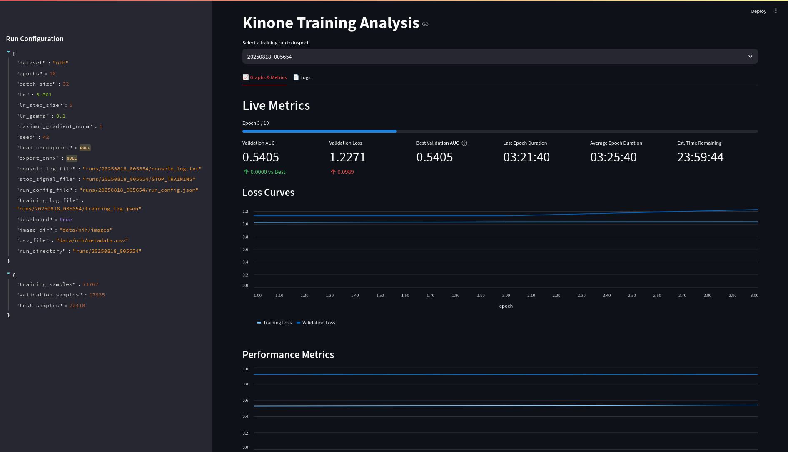

# Kinone

> 木の根  
> Ki no ne  
> Roots of a tree

<p align="center">
  
</p>

Kinone is a re-implementation of essential componenets
of modern gradient based learning,
written from first principles in pure NumPy.
By design it is:

- Deterministic: No hidden kernels or device dependent determinism.
- Transparent: No black boxes, every mathematical transformation is
explicit and auditable.
- Extensible: New operators require the forward definition and its analytic gradient.
(Could be changed if we introduce [JAX](https://docs.jax.dev/en/latest/quickstart.html))
- Reliable: Full test coverage with finite-difference checks for all primitives.

Kinone is in no way a competetor to JAX, PyTorch or TensorFlow,
it is a learning project and a scaffold for experiments
that require total algorithmic control and reportability.

The report cab be found in `pdf` format
[here](report/main.pdf).

## Mathematical Foundations

Let

```math
\mathcal{T} = (\mathbf{Z}, \, \partial L), \qquad
\mathbf{Z} \in \mathbb{R}^{n_1 \times \dots \times n_d},
```

denote a tensor together with an accumulator for its upstream adjoint.

Every primitive operator

```math
g : \mathbb{R}^{m} \to \mathbb{R}^{k},\qquad
\mathbf{u} = g(\mathbf{v}),
```

is registered with its Jacobian

```math
J_g(\mathbf{v}) = \frac{\partial g}{\partial \mathbf{v}}(\mathbf{v}) \in \mathbb{R}^{k \times m}.
```

For a scalar objective $\mathcal{L}$ the reverse‑mode update is

```math
\nabla_{\mathbf{v}} \mathcal{L} = J_g(\mathbf{v})^{\! \top} \, \nabla_{\mathbf{u}} \mathcal{L}
```

The system adheres to the [define‑by‑run](https://docs.chainer.org/en/stable/guides/define_by_run.html) paradigm: during the forward pass it records a dynamic DAG
$`G=(V, \,E)`$, and the backward pass traverses $V$ in reverse [topological order](https://en.wikipedia.org/wiki/Topological_sorting), applying the update above at every node.

Memory overhead equals the set of stored activations; checkpointing or recomputation can lower this below a naïve linear bound in the number of forward operations.

---

##  Implemented Operator Set

| Category | Symbolic Definition |
| - | - |
| Elementwise| $y_i = \phi(x_i)\quad(\phi\in\{+,−,\times,\div,etc.})$ |
| Matrix Multiplication | $\mathbf{Y}=\mathbf{A}\mathbf{B}$ |
| Convolution 2-D | $Y_{c,j,k}=\sum_{p,q}X_{c,j+p,k+q}W_{c,p,q}$ |
| Pooling | $\max, \text{avg}$ |
| Norms | BatchNorm ($\mu$, $\sigma^2$ estimated) |

> Future plans include other missing operations such as
`Attention` style operatations

---

##  Canonical Models

The modules in `src/core/` cover the following function classes:

$$
\mathcal{F}_{\text{CNN}} = \{ f\circ g\_L\circ\cdots\circ g\_1 \;\bigl|\;
g\_i\in\{\text{Conv},\text{BN},\sigma,\text{Pool}\},\; f\in\text{Linear} \},
$$

which subsumes a sample ResNet - $d$ with
$d\in\{18,34,50,101,152\}$ implementation
for multi-label classification of NIH ChestX-ray dataset.

---

## Project Layout

```
Kinone
├── src/
│   ├── core/          # tensor, autograd, nn layers
│   ├── data/          # NIH ChestX-ray14 loader
│   └── scripts/       # dataset download, ONNX export
├── train.py           # SGD/Adam loop
├── evaluate.py        # metrics + ROC-AUC
├── dashboard.py       # Streamlit inference UI
├── tests/             # finite-difference checks
└── README.md          # you are here
```

---

## Installation

The recommended way to work with this repository is to install and use [uv](https://docs.astral.sh/uv/).

```bash
git clone https://github.com/pseudofractal/kinone.git
cd kinone
uv sync # Or equivalent if you are not using uv
```

Dependencies (`pyproject.toml` pinned):

- `numpy`
- `opencv-python`
- `albumentations`
- `onnxruntime`
- `streamlit`
- `pytest`

---

## Usage Examples

This section provides a step-by-step guide to using the scripts in this project.

### 1. Download the Dataset

First, download the NIH Chest X-ray dataset. This script will fetch and extract all image archives.

```bash
# Download and extract the NIH Chest X-ray14 dataset (approx. 42 GB)
python -m src.scripts.download_nih_dataset --out-dir data/nih
```
**Important:** The metadata file is not downloaded automatically. You must manually download `Data_Entry_2017.csv` from the official dataset page and save it as `data/nih/metadata.csv` for the training script to work.

### 2. Train a Model

Start a new training run. A new directory will be created under `runs/` to store logs, configuration, and model checkpoints.

```bash
# Start a new training run with a 10-epoch schedule
python main.py --epochs 10 --batch-size 32 --lr 1e-3 --dashboard
```

To resume training from a previously saved checkpoint, use the `--load-checkpoint` argument.

```bash
# Continue training from the best model of a previous run
# This will load the weights and continue for another 10 epochs
python main.py --load-checkpoint runs/20250817_180000/checkpoints/best_model_....npz --epochs 10
```

### 3. Evaluate a Trained Model

After a training run is complete, you can evaluate its best-performing checkpoint on the test set.

```bash
# Evaluate the best model from a specific training run
python evaluate.py --run-dir runs/20250817_180000
```

### 4. Export to ONNX

Export the best model from a training run into the ONNX format for interoperability.

```bash
# Export the best model from a run to model.onnx
python export_onnx.py --run-dir runs/20250817_180000 --output-filename model.onnx
```

### 5. Run Inference on a Single Image

Use a trained model to get predictions for a single image file.

```bash
# Get predictions for a single chest X-ray image
python predict.py --run-dir runs/20250817_180000 --image-path /path/to/your/image.png
```

### 6. Launch the Dashboard

The dashboard has two modes: Live Mode for monitoring an active training session, and Analysis Mode for reviewing completed runs.

**Live Mode** is launched automatically by `main.py` or explicitly when you use the `--dashboard` flag, as shown in the training example. It provides real-time metrics and controls to stop the training process. Use `--no-dashboard` flag for `main.py` to not launch without dashboard.

**Analysis Mode** allows you to inspect the results of any past run. When launched directly, it will automatically find all training sessions in the `runs/` directory and let you choose one from a dropdown menu.

```bash
# Launch the dashboard in Analysis Mode to review past runs
streamlit run dashboard.py
```
---

## Testing Process

For every scalar function $f:\mathbb{R}^n \to \mathbb{R}$ we verify that the
analytic gradient produced by Kinone

$$
\nabla f(\mathbf{x}) = \frac{\partial f}{\partial \mathbf{x}}
$$

matches a second‑order central‑difference estimate

$$
\hat{\nabla}f(\mathbf{x})=\frac{f(\mathbf{x}+h)-f(\mathbf{x}-h)}{2h}
$$

with step $h=10^{-3}$ (float32 default).

We report the relative error

$$
\varepsilon_{\text{rel}}
=\frac{\lVert\hat{\nabla}f-\nabla f\rVert_2}
{\lVert\nabla f\rVert_2+\varepsilon},
$$

and require $\varepsilon_{\text{rel}}<10^{-4}$ (use $\varepsilon=10^{-6}$ to avoid
division by zero when $\nabla f\approx0$).

After editing any code, run all checks:

```bash
pytest -q
```

---
